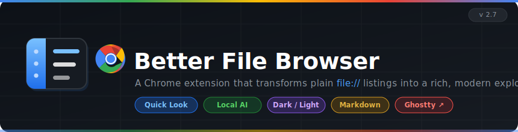

<div align="center">
  
</div>

<br/>

A Chrome extension that replaces the browser's plain `file://` directory listings with a modern, feature-rich file explorer.

---

## Architecture

```
Chrome navigates to file:///some/path/
        │
        ▼
┌─────────────────────────────────────────────────────────────┐
│  loader.js          (run_at: document_start)                │
│  └─ Immediately hides <body> to prevent default listing     │
│     flash — checks URL ends with "/" before acting          │
└─────────────────────────────────────────────────────────────┘
        │
        ▼
┌─────────────────────────────────────────────────────────────┐
│  content.js         (run_at: document_end)                  │
│  ├─ 1. Detect: document.title.startsWith("Index of")        │
│  ├─ 2. Parse Chrome's <table> with data-value attributes    │
│  ├─ 3. Replace full DOM with custom UI                      │
│  └─ 4. Attach events (search, sort, tooltips, sidebar…)     │
└─────────────────────────────────────────────────────────────┘
        │
        ▼
┌──────────────┬──────────────────────────────────────────────┐
│  SIDEBAR     │  PATH BAR   / Users › alcatraz627 › Code     │
│              ├──────────────────────────────────────────────┤
│  Finder Favs │  TOOLBAR  [zoom] [Details][List][Tiles][Icons]│
│  ★ Code      ├──────────────────────────────────────────────┤
│  ★ Downloads │  Name         │ Type   │ Size    │ Modified   │
│              │  📁 src/      │ Folder │  —      │ Apr 17     │
│  Places      │  🟨 index.js  │ JS     │ 4.2 KB  │ Apr 17     │
│  🖥 Root     │  🔷 types.ts  │ TS     │ 1.1 KB  │ Apr 15     │
│  🏠 Home     │  {} pkg.json  │ JSON   │  890 B  │ Apr 10     │
│  📋 Docs     │                                               │
│  ⬇ Down     │                                               │
└──────────────┴───────────────────────────────────────────────┘
```

---

## Features

### Views
| Mode | Description |
|------|-------------|
| **Details** | Full table — Name, Type, Size, Modified |
| **List** | Compact single-column rows |
| **Tiles** | Medium icon grid with name below |
| **Large Icons** | Oversized icon grid |

Switch with the toolbar buttons. Preference persists across sessions.

### Toolbar
- **Zoom slider** — scales the entire file list proportionally (50–200%)
- **View toggle** — Details / List / Tiles / Large Icons
- **Search** — live filter by filename as you type (covers all view modes)
- **Hidden files** — show/hide dotfiles with one click
- **Terminal** — open current folder in Ghostty (or copy path to clipboard)
- **Theme** — dark / light toggle; persisted in `localStorage`

### Sidebar
- **Finder Favourites** — parsed from your macOS SFL4 sidebar binary at install time and hardcoded (live sync isn't possible from a sandboxed extension)
- **Quick Places** — Root, Home, Desktop, Documents, Downloads
- **Bookmarks** — star (☆) any folder to save it; drag rows to reorder; ✕ to remove
- All bookmark state persists in `localStorage`

### File Icons
30+ file types with distinct SVG icons and per-extension colour coding:

| Category | Colour |
|----------|--------|
| JS / MJS | Golden yellow |
| TS / TSX / JSX | Blue / Cyan |
| HTML / CSS | Orange / Deep blue |
| Python / Go / Rust | Blue variants |
| Images | Purple |
| Video / Audio | Red / Orange |
| Archives | Brown |
| JSON / YAML | Teal / Red |

Special folders (Desktop, Documents, Downloads, Code, etc.) render in amber; generic folders in blue.

### Tooltips
Hover any item for a rich tooltip showing:
- Full filename
- Full path
- File type
- Size (formatted)
- Modified date
- Hidden file indicator (if dotfile)

> Permissions, creation date, and image dimensions require the optional native host.

---

## Installation

### 1. Load the extension

1. Open `chrome://extensions/`
2. Enable **Developer mode** (top-right toggle)
3. Click **Load unpacked** → select this folder (`better-file-browser/`)
4. On the extension card → **Details** → enable **"Allow access to file URLs"**

### 2. (Optional) Ghostty terminal integration

```bash
# Find your Extension ID on chrome://extensions, then:
cd native/
./install.sh <your-extension-id>
```

This registers a native messaging host that lets the terminal button open Ghostty directly in the current folder.

Without this step the terminal button copies the path to your clipboard with instructions.

---

## What's not supported

| Feature | Reason |
|---------|--------|
| System Finder icons (`.icns`) | Chrome's extension sandbox cannot read macOS metadata APIs |
| Live Finder sidebar sync | Favourites live in a binary plist inaccessible from a browser extension |
| File permissions / creation date | Require a native filesystem agent |
| Image dimensions in tooltips | Require loading each image — possible future enhancement with native host |

---

## File structure

```
better-file-browser/
├── manifest.json               MV3 extension manifest
├── loader.js                   document_start: hides Chrome listing before render
├── content.js                  document_end: parses + replaces the full page
├── icon.svg                    Extension icon (dark rounded square + folder)
├── README.md
└── native/
    ├── ghostty_launcher.py     Native messaging host (Python)
    ├── install.sh              Registers the host with Chrome
    └── com.better_file_browser.ghostty.json  Host manifest template
```

---

## Development

All logic lives in `content.js`. After any edit:

1. Open `chrome://extensions/`
2. Click the refresh icon on the **Better File Browser** card
3. Reload any open `file://` tab

The extension uses no bundler, no dependencies, and no network requests.

---

## Possible future enhancements

- **Image preview** — thumbnail on hover for PNG/JPG/GIF/SVG (possible in-extension with ``)
- **File permissions** — displayed via native host returning `os.stat()` data
- **Multi-select** — shift/cmd-click to select multiple items, then copy paths
- **Keyboard navigation** — arrow keys, Enter to open, Backspace to go up
- **Custom places** — user-editable quick-access list beyond the fixed Places section
- **Context menu** — right-click for Copy Path, Copy Name, Open in Terminal
- **Column resize** — drag column headers to adjust widths
- **Recently visited** — history of the last N directories browsed
