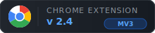

<div align="center">
  
  <br/><br/>
  
  &nbsp;&nbsp;
  
</div>

<br/>

A Chrome extension that replaces the browser's plain `file://` directory listings with a modern, feature-rich file explorer.

---

## Architecture

```
Chrome navigates to file:///some/path/
        │
        ▼
┌─────────────────────────────────────────────────────────────┐
│  loader.js          (run_at: document_start)                │
│  └─ Immediately hides <body> to prevent default listing     │
│     flash — checks URL ends with "/" before acting          │
└─────────────────────────────────────────────────────────────┘
        │
        ▼
┌─────────────────────────────────────────────────────────────┐
│  content.js         (run_at: document_end)                  │
│  ├─ 1. Detect: document.title.startsWith("Index of")        │
│  ├─ 2. Parse Chrome's <table> with data-value attributes    │
│  ├─ 3. Replace full DOM with custom UI                      │
│  └─ 4. Attach events (search, sort, tooltips, sidebar…)     │
└─────────────────────────────────────────────────────────────┘
        │
        ▼
┌──────────────┬──────────────────────────────────────────────┐
│  SIDEBAR     │  PATH BAR   / Users › alcatraz627 › Code     │
│              ├──────────────────────────────────────────────┤
│  Finder Favs │  TOOLBAR  [zoom] [Details][List][Tiles][Icons]│
│  ★ Code      ├──────────────────────────────────────────────┤
│  ★ Downloads │  Name         │ Type   │ Size    │ Modified   │
│              │  📁 src/      │ Folder │  —      │ Apr 17     │
│  Places      │  🟨 index.js  │ JS     │ 4.2 KB  │ Apr 17     │
│  🖥 Root     │  🔷 types.ts  │ TS     │ 1.1 KB  │ Apr 15     │
│  🏠 Home     │  {} pkg.json  │ JSON   │  890 B  │ Apr 10     │
│  📋 Docs     │                                               │
│  ⬇ Down     │                                               │
└──────────────┴───────────────────────────────────────────────┘
```

---

## Features

### Views
| Mode | Description |
|------|-------------|
| **Details** | Full table — Name, Type, Size, Modified |
| **List** | Compact single-column rows |
| **Tiles** | Medium icon grid with name below |
| **Large Icons** | Oversized icon grid |

Switch with the toolbar buttons. Preference persists across sessions.

### Toolbar
- **Zoom slider** — scales the entire file list proportionally (50–320%)
- **View toggle** — Details / List / Tiles / Large Icons
- **Search** — live filter by filename as you type (covers all view modes)
- **Hidden files** — show/hide dotfiles with one click
- **Terminal** — open current folder in Ghostty (or copy path to clipboard)
- **Theme** — dark / light toggle; persisted in `localStorage`

### File preview (Quick Look)
Select a file and press **Space** (or click the eye button on hover, or right-click → Preview) for a centered overlay that renders the file in place — Esc closes, ↑/↓ step between previewable files. Renders by type:

| File type | Rendering |
|-----------|-----------|
| `.sh`, `.ts`/`.tsx`, `.py`, `.go`, `.rs`, `.sql`, `.yaml`, `.toml`, `.env`, CSS/HTML… | Syntax highlighting + line numbers |
| `.tsv` / `.csv` | Sortable table; numeric columns detected and right-aligned |
| `.json` | Collapsible tree |
| `.jsonl` / `.ndjson` | One collapsible row per line; malformed lines badged |
| `.md` / `.mdx` | Rendered markdown — headings, code fences, tables, lists, sanitized inline HTML; relative image/link paths resolve against the file |
| Images | Fit-to-view |
| `.pdf` | Embedded PDF viewer |
| Audio / video (`.mp4`, `.webm`, `.mp3`, `.flac`…) | Native player |
| Fonts (`.ttf`, `.otf`, `.woff`, `.woff2`) | Multi-size glyph specimen |

A **copy** button in the header copies the full raw file contents. Previews fetch `file://` content through the background service worker (page-context `file://` XHR is CORS-blocked in current Chrome), so no extra permissions are required.

### AI (local model) — optional
With the [local-models `lm` CLI](https://github.com/alcatraz627/local-models) installed, the preview gains an **AI bar**: **Summarize**, **Explain** (→ **Describe** for tabular files), and an **Ask** box. Answers stream in and render as markdown; closing the overlay cancels the generation. A status chip shows whether the model is warm/cold/down, and the settings modal has a **Local Model** panel with a live status blinker, a **model picker** (choose any installed model; passed as `-m`), and a **Keep warm / Unload** toggle (runs `lm warm on/off`). Fully local — the extension shells out to `lm` via a native messaging host; no network egress. Requires the `install.sh` step below.

### Keyboard & navigation
- **↑ / ↓** move the selection, **Enter** opens, **Backspace** or **⌘↑** goes to the parent
- **Space** opens Quick Look on the selected file
- **⌘F** focuses the filter; press again to fall through to the browser's native find
- **Esc** in the filter clears it

### Context menu
Right-click any row or tile for **Preview · Copy path · Copy name · Open in terminal**.

### Sidebar
- **Finder Favourites** — parsed from your macOS SFL4 sidebar binary at install time and hardcoded (live sync isn't possible from a sandboxed extension)
- **My Places** — your own editable quick-access list: **+** adds the current folder, double-click a label to rename, drag to reorder, ✕ to remove
- **Recent** — the last directories you browsed (persisted in `localStorage`)
- **Quick Places** — Root, Home, Desktop, Documents, Downloads
- **Bookmarks** — star (☆) any folder to save it; drag rows to reorder; ✕ to remove
- All sidebar state persists in `localStorage`

Details-view columns are resizable — drag a header's right edge; widths persist. Rows support multi-select (shift-click range, ⌘/ctrl-click toggle, ⌘A), and ⌘C copies the selected paths.

### Breadcrumbs
Each path segment has a **▾** dropdown that lists that folder's contents with a focused filter box — type to narrow, Enter opens the first match.

### File Icons
30+ file types with distinct SVG icons and per-extension colour coding:

| Category | Colour |
|----------|--------|
| JS / MJS | Golden yellow |
| TS / TSX / JSX | Blue / Cyan |
| HTML / CSS | Orange / Deep blue |
| Python / Go / Rust | Blue variants |
| Images | Purple |
| Video / Audio | Red / Orange |
| Archives | Brown |
| JSON / YAML | Teal / Red |

Special folders (Desktop, Documents, Downloads, Code, etc.) render in amber; generic folders in blue.

### Tooltips
Hover any item for a rich tooltip showing:
- Full filename
- Full path
- File type
- Size (formatted)
- Modified date
- Hidden file indicator (if dotfile)

> Permissions, creation date, and image dimensions require the optional native host.

---

## Installation

### 1. Load the extension

1. Open `chrome://extensions/`
2. Enable **Developer mode** (top-right toggle)
3. Click **Load unpacked** → select this folder (`better-file-browser/`)
4. On the extension card → **Details** → enable **"Allow access to file URLs"**

### 2. (Optional) Native messaging hosts — terminal + AI

```bash
# Find your Extension ID on chrome://extensions, then:
cd native/
./install.sh <your-extension-id>
```

This registers two native messaging hosts:
- **Ghostty launcher** — lets the terminal button open Ghostty directly in the current folder. Without it, the button copies the path to your clipboard instead.
- **lm bridge** — lets the preview's AI bar run the local `lm` CLI. Without it (or without `lm` installed), the AI bar simply doesn't appear; everything else works unchanged.

---

## What's not supported

| Feature | Reason |
|---------|--------|
| System Finder icons (`.icns`) | Chrome's extension sandbox cannot read macOS metadata APIs |
| Live Finder sidebar sync | Favourites live in a binary plist inaccessible from a browser extension |
| File permissions / creation date | Require a native filesystem agent |
| Image dimensions in tooltips | Require loading each image — possible future enhancement with native host |

---

## File structure

```
better-file-browser/
├── manifest.json               MV3 extension manifest
├── loader.js                   document_start: hides Chrome listing before render
├── content.js                  document_end: bundled output (esbuild) — DO NOT edit by hand
├── background.js               service worker: file:// fetch relay + native-host proxy
├── build.ts                    esbuild bundler (src/ → content.js)
├── src/                        TypeScript sources (entry: main.ts)
│   ├── main.ts                 page replacement, events, settings, keyboard, context menu
│   ├── preview.ts              Quick Look overlay + AI bar
│   ├── renderers.ts            pure render fns: code/DSV/JSON/JSONL/markdown (unit-tested)
│   ├── llm.ts                  native-messaging client for the lm CLI
│   ├── file-fetch.ts           service-worker fetch relay client
│   ├── parse.ts · render.ts · sort-filter.ts · icons.ts · storage.ts · utils.ts · types.ts
├── tests/                      vitest unit tests
├── icon.svg                    Extension icon (dark rounded square + folder)
├── README.md
└── native/
    ├── ghostty_launcher.py     Native host: opens Ghostty
    ├── llm_host.py             Native host: bridges the preview AI bar to the lm CLI
    ├── install.sh              Registers both hosts with Chrome
    └── com.better_file_browser.{ghostty,llm}.json  Host manifest templates
```

---

## Development

Logic lives in `src/` (TypeScript) and bundles to `content.js` via esbuild.

```bash
npm install
npm run build      # src/ → content.js  (npm run watch for incremental)
npm test           # vitest unit tests (renderers, parsing)
```

After a build:

1. Open `chrome://extensions/`
2. Click the refresh icon on the **Better File Browser** card
3. Reload any open `file://` tab

`content.js` is generated — never edit it by hand; edit `src/` and rebuild. The extension makes no remote network requests; the only `fetch` calls read local `file://` URLs (via the service worker) and, if enabled, the AI bar talks to the local `lm` CLI through a native host.

---

## Possible future enhancements

- **File permissions** — displayed via native host returning `os.stat()` data
- **Markdown image rendering** — currently `` in previewed markdown points at relative paths that don't resolve under `file://`

_Shipped since v2.2: Quick Look preview, rich renderers, local-model AI bar, keyboard navigation, context menu, recent directories, breadcrumb dropdown search, multi-select, column resize, custom Places._
