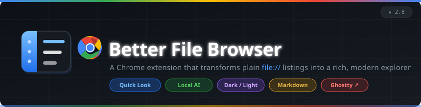
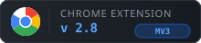

<div align="center">
  
  <br/><br/>
  
  &nbsp;&nbsp;
  
</div>

<br/>

A Chrome extension that replaces the browser's plain `file://` directory listings with a modern, feature-rich file explorer.

---

## Architecture

```
Chrome navigates to file:///some/path/
        │
        ▼
┌─────────────────────────────────────────────────────────────┐
│  loader.js          (run_at: document_start)                │
│  └─ Immediately hides <body> to prevent default listing     │
│     flash — checks URL ends with "/" before acting          │
└─────────────────────────────────────────────────────────────┘
        │
        ▼
┌─────────────────────────────────────────────────────────────┐
│  content.js         (run_at: document_end)                  │
│  ├─ 1. Detect: document.title.startsWith("Index of")        │
│  ├─ 2. Parse Chrome's <table> with data-value attributes    │
│  ├─ 3. Replace full DOM with custom UI                      │
│  └─ 4. Attach events (search, sort, tooltips, sidebar…)     │
└─────────────────────────────────────────────────────────────┘
        │
        ▼
┌──────────────┬──────────────────────────────────────────────┐
│  SIDEBAR     │  PATH BAR   / Users › alcatraz627 › Code     │
│              ├──────────────────────────────────────────────┤
│  Finder Favs │  TOOLBAR  [zoom] [Details][List][Tiles][Icons]│
│  ★ Code      ├──────────────────────────────────────────────┤
│  ★ Downloads │  Name         │ Type   │ Size    │ Modified   │
│              │  📁 src/      │ Folder │  —      │ Apr 17     │
│  Places      │  🟨 index.js  │ JS     │ 4.2 KB  │ Apr 17     │
│  🖥 Root     │  🔷 types.ts  │ TS     │ 1.1 KB  │ Apr 15     │
│  🏠 Home     │  {} pkg.json  │ JSON   │  890 B  │ Apr 10     │
│  📋 Docs     │                                               │
│  ⬇ Down     │                                               │
└──────────────┴───────────────────────────────────────────────┘
```

---

## Features

### Views
| Mode | Description |
|------|-------------|
| **Details** | Full table — Name, Type, Size, Modified |
| **List** | Compact single-column rows |
| **Tiles** | Medium icon grid with name below |
| **Large Icons** | Oversized icon grid |

Switch with the toolbar buttons. Preference persists across sessions.

### Toolbar
- **Zoom slider** — scales the entire file list proportionally (50–320%)
- **View toggle** — Details / List / Tiles / Large Icons
- **Search** — live filter by filename as you type (covers all view modes)
- **Hidden files** — show/hide dotfiles with one click
- **Terminal** — open current folder in Ghostty (or copy path to clipboard)
- **Theme** — dark / light toggle; persisted in `localStorage`

### File preview (Quick Look)
Select a file and press **Space** (or click the eye button on hover, or right-click → Preview) for a centered overlay that renders the file in place — Esc closes, ↑/↓ step between previewable files. Renders by type:

| File type | Rendering |
|-----------|-----------|
| `.sh`, `.ts`/`.tsx`, `.py`, `.go`, `.rs`, `.sql`, `.yaml`, `.toml`, `.env`, CSS/HTML… | Syntax highlighting + line numbers |
| `.tsv` / `.csv` | Sortable table; numeric columns detected and right-aligned |
| `.json` | Collapsible tree |
| `.jsonl` / `.ndjson` | One collapsible row per line; malformed lines badged |
| `.md` / `.mdx` | Rendered markdown — headings, code fences, tables, lists, sanitized inline HTML; relative image/link paths resolve against the file |
| Images | Fit-to-view, with pixel dimensions (W × H) |
| `.pdf` | Embedded PDF viewer |
| Audio / video (`.mp4`, `.webm`, `.mp3`, `.flac`…) | Native player |
| Fonts (`.ttf`, `.otf`, `.woff`, `.woff2`) | Multi-size glyph specimen |

A **copy** button in the header copies the full raw file contents. Previews fetch `file://` content through the background service worker (page-context `file://` XHR is CORS-blocked in current Chrome), so no extra permissions are required.

### AI (local model) — optional
With the [local-models `lm` CLI](https://github.com/alcatraz627/local-models) installed, the preview gains an **AI bar**: **Summarize**, **Explain** (→ **Describe** for tabular files), and an **Ask** box. Answers stream in and render as markdown; closing the overlay cancels the generation. A status chip shows whether the model is warm/cold/down, and the settings modal has a **Local Model** panel with a live status blinker, a **model picker** (choose any installed model; passed as `-m`), and a **Keep warm / Unload** toggle (runs `lm warm on/off`). Fully local — the extension shells out to `lm` via a native messaging host; no network egress. Requires the `install.sh` step below.

### Keyboard & navigation
- **↑ / ↓** move the selection, **Enter** opens, **Backspace** or **⌘↑** goes to the parent
- **Space** opens Quick Look on the selected file
- **⌘F** focuses the filter; press again to fall through to the browser's native find
- **Esc** in the filter clears it

### Context menu
Right-click any row or tile for **Preview · Copy path · Copy name · Open in terminal**.

### Tabs
The strip above the toolbar is the working set of one Chrome tab: folders and files, shown on the explorer and on file pages. State lives in `sessionStorage`, so it survives refresh and navigation and ends with the Chrome tab; a copy in `chrome.storage.local` brings a strip closed within the last day back into a fresh tab, with an undo. The place you are in shows as an italic tab until **t** or a double-click keeps it. **w** closes, **p** pins (pinned tabs sit first with no ✕), **[** and **]** step, **1** to **9** jump, drag reorders, middle-click closes, and **…** on hover offers copy path, save, pin, close and close others. Every gesture and key is listed in [`docs/mouse-key-audit.md`](docs/mouse-key-audit.md). Navigation is real, so the address bar is always the active tab's location.

### Sidebar
- **Saved**: one list of your folders. The ★ in the path bar saves or unsaves the current folder, and **+** saves it with the name open for editing. Double-click a label to rename, drag to reorder, ✕ to remove. Hover a row and press **#** to type comma-separated tags. Tagged folders group under a coloured heading, and clicking the heading's dot changes the colour. Bookmarks and My Places from earlier versions are merged in on first load.
- **Notes**: appears once a Notes folder is set in Settings (see below).
- **Recent**: the last directories you browsed.
- **Finder Favourites** and **System**: fixed quick jumps.
- All sidebar state persists in `localStorage`.

### Notes
Set a **Notes folder** in Settings and a Notes section lists its `.md` files newest first. **n** or **+** starts a note. The preview panel becomes an editor with the source on the left and the render on the right. A toolbar covers bold, italic, code, lists, tasks, tables and images. ⌥↑↓ moves lines and ⌥⇧↑↓ duplicates them. Tab indents. Enter continues a list. A pasted or dropped image is saved under `attachments/` and linked by relative path. **⌘S** saves, a 1.5 s pause autosaves, and a note created as untitled takes its first heading as its file name on first save. Rename by double-click; ✕ moves the note into `.trash/` inside the folder. Files are written through a native host that refuses any path outside the folder and detects edits made by other programs. The folder is plain markdown with optional front matter, readable by Obsidian and any markdown tool. The rules are in [`docs/notes-contract.md`](docs/notes-contract.md).

### File pages
A file opened directly in the tab (markdown, code, json, jsonl, tsv/csv, txt) renders like the preview instead of Chrome's plain text: folder crumbs, a heading table of contents for markdown, **r** for raw, a remembered scroll position, and a re-render whenever the file changes on disk. Settings can limit this to non-markdown files or turn it off if you keep another markdown extension on file URLs.

### Find and saved views
The Filter panel's second row searches **text inside files**: the text files the name and type fields allow (2 MB each at most) are read through the service worker, four at a time, with progress and a Cancel button, and the listing keeps only the ones that contain your words until you run again or clear the field. **Save view** keeps the folder plus the query as a Saved row with a funnel icon; the row is a plain URL with the query in its hash, so opening it brings the search back, and a hash change on an open page applies it in place.

### Deep search
The folder button beside the filter box includes every subfolder. Names show their path from the current folder, so `src/main.ts` matches `main`. The scan skips `node_modules`, `.git` and dot-folders, stops at 8 levels or 5000 items, and runs once per page.

Details-view columns are resizable: drag a header's right edge; widths persist. A plain click on a file opens it in the panel and leaves the address bar alone. A plain click on a folder goes there. Double-click opens a file's page in this tab, ⌥-click keeps the item as a background strip tab, and middle-click opens a Chrome tab. Rows support multi-select (shift-click or ⌘/ctrl-click toggles, ⇧⌘-click ranges, ⌘A), and ⌘C copies the selected paths.

### Breadcrumbs
Each path segment has a **▾** dropdown that lists that folder's contents with a focused filter box — type to narrow, Enter opens the first match.

### File Icons
30+ file types with distinct SVG icons and per-extension colour coding:

| Category | Colour |
|----------|--------|
| JS / MJS | Golden yellow |
| TS / TSX / JSX | Blue / Cyan |
| HTML / CSS | Orange / Deep blue |
| Python / Go / Rust | Blue variants |
| Images | Purple |
| Video / Audio | Red / Orange |
| Archives | Brown |
| JSON / YAML | Teal / Red |

Special folders (Desktop, Documents, Downloads, Code, etc.) render in amber; generic folders in blue.

### Tooltips
Hover any item for a rich tooltip showing:
- Full filename
- Full path
- File type
- Size (formatted)
- Modified date
- Hidden file indicator (if dotfile)

> Permissions, creation date, and image dimensions require the optional native host.

---

## Installation

### 1. Load the extension

1. Open `chrome://extensions/`
2. Enable **Developer mode** (top-right toggle)
3. Click **Load unpacked** → select this folder (`better-file-browser/`)
4. On the extension card → **Details** → enable **"Allow access to file URLs"**

### 2. (Optional) Native messaging hosts — terminal + AI

```bash
# Find your Extension ID on chrome://extensions, then:
cd native/
./install.sh <your-extension-id>
```

This registers two native messaging hosts:
- **Ghostty launcher** — lets the terminal button open Ghostty directly in the current folder. Without it, the button copies the path to your clipboard instead.
- **lm bridge** — lets the preview's AI bar run the local `lm` CLI. Without it (or without `lm` installed), the AI bar simply doesn't appear; everything else works unchanged.

---

## What's not supported

| Feature | Reason |
|---------|--------|
| System Finder icons (`.icns`) | Chrome's extension sandbox cannot read macOS metadata APIs |
| Live Finder sidebar sync | Favourites live in a binary plist inaccessible from a browser extension |
| File permissions / creation date | Require a native filesystem agent |
| Image dimensions in tooltips | Require loading each image — possible future enhancement with native host |

---

## File structure

```
better-file-browser/
├── manifest.json               MV3 extension manifest
├── loader.js                   document_start: hides Chrome listing before render
├── content.js                  document_end: bundled output (esbuild) — DO NOT edit by hand
├── background.js               service worker: file:// fetch relay + native-host proxy
├── build.ts                    esbuild bundler (src/ → content.js)
├── src/                        TypeScript sources (entry: main.ts)
│   ├── main.ts                 page replacement, events, settings, keyboard, context menu
│   ├── preview.ts              Quick Look panel (modal or docked) + AI bar + note editor
│   ├── file-page.ts            takeover for a file opened directly in the tab
│   ├── renderers.ts            pure render fns: code/DSV/JSON/JSONL/markdown (unit-tested)
│   ├── deep-search.ts          pure subtree crawler behind the deep search toggle
│   ├── tabs.ts · places.ts     pure cores for the tab strip and the Saved list
│   ├── notes.ts · editor.ts    notes host client + front matter; undo/insert core
│   ├── llm.ts                  native-messaging client for the lm CLI
│   ├── file-fetch.ts           service-worker fetch relay client (retries, error codes)
│   ├── parse.ts · render.ts · sort-filter.ts · icons.ts · storage.ts · utils.ts · types.ts
├── tests/                      vitest unit tests
├── e2e/                        browser harness + smoke run (npm run e2e)
├── docs/                       feature-set model, notes contract, design notes
├── icon.svg                    Extension icon (dark rounded square + folder)
├── README.md
└── native/
    ├── ghostty_launcher.py     Native host: opens Ghostty
    ├── llm_host.py             Native host: bridges the preview AI bar to the lm CLI
    ├── notes_host.py           Native host: reads and writes notes in one folder
    ├── test_notes_host.py      Protocol test for the notes host
    ├── install.sh              Registers the three hosts with Chrome
    └── com.better_file_browser.{ghostty,llm,notes}.json  Host manifest templates
```

---

## Development

Logic lives in `src/` (TypeScript) and bundles to `content.js` via esbuild.

```bash
npm install
npm run build      # src/ → content.js  (npm run watch for incremental)
npm test           # vitest unit tests (renderers, parsing, storage, crawler, tabs)
npm run e2e        # browser run: Chrome for Testing + puppeteer, screenshots in e2e/shots/
npm run e2e:light  # the same checks on the light theme
```

The e2e harness needs Chrome for Testing once: `npx @puppeteer/browsers install chrome@stable`. `BFB_CHROME` overrides the binary, `BFB_HEADED=1` shows the window.

After a build:

1. Open `chrome://extensions/`
2. Click the refresh icon on the **Better File Browser** card
3. Reload any open `file://` tab

`content.js` is generated — never edit it by hand; edit `src/` and rebuild. The extension makes no remote network requests; the only `fetch` calls read local `file://` URLs (via the service worker) and, if enabled, the AI bar talks to the local `lm` CLI through a native host.

---

## Possible future enhancements

- **File permissions** — displayed via native host returning `os.stat()` data
- **Markdown image rendering** — currently `` in previewed markdown points at relative paths that don't resolve under `file://`

_Shipped since v2.2: Quick Look preview (modal or docked), rich renderers, local-model AI bar (with model picker + warm toggle), keyboard navigation, context menu, recent directories, breadcrumb dropdown search, multi-select, column resize, Saved folders with tags, tabs, Notes, rendered file pages, deep search, categorized syntax highlighting, and image dimensions._

---

## Changelog

| Version | Highlights |
|---------|------------|
| **2.8** | Tabs (shared working set), Saved list replacing Bookmarks + My Places (names, tags, colours), Notes editor with a native host and a documented file contract, rendered file pages with ToC and autoreload, deep search, preview docks to the side or floats and resizes, preview links open in new tabs, sort/group persist, relay retry + reloaded-extension message, in-repo e2e harness |
| **2.7.1** | Image dimensions (W × H) in the preview |
| **2.7** | AI bar model picker (`-m`) + Keep-warm/Unload toggle |
| **2.6** | Syntax-highlighter upgrade — categorized keywords (control/type/builtin/literal), Python triple-quotes & string prefixes, Rust raw strings, decorators, richer numbers |
| **2.5** | Markdown relative-path resolution; PDF / audio / video / font previews |
| **2.4** | Date-parse fix (epoch, not the locale string — also fixes date sorting); multi-select with bulk copy; resizable columns; custom "My Places" sidebar |
| **2.3** | Documented the v2.x features; manifest/package version sync |
| **2.2** | TypeScript + esbuild + vitest migration; settings modal |
